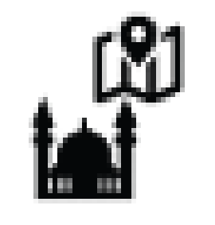
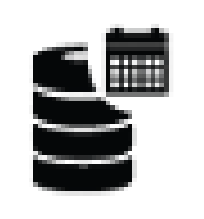
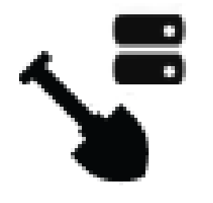
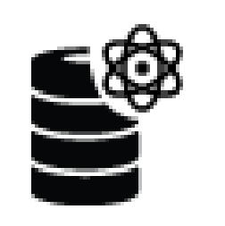
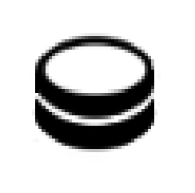
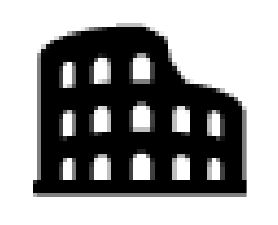
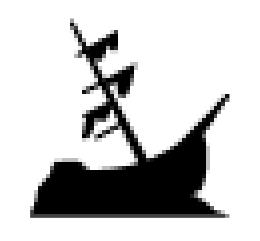
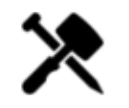
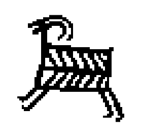

In the first phase of the ARIADNE project there were nine top level ARIADNE subjects. 
With the increased number of archaeological sub-domains represented in ARIADNEplus this was
expanded to 13, reflecting the range of datasets provided. 
In the ARIADNE RI this has been extended to 14, adding E-publication for the ATRIUM project. 
Where data are aggregated at item level, the same ARIADNE subject is applied to the collection record.

`PREFIX aat: <http://vocab.getty.edu/page/aat/>`

## Site/monument

{width=60px}

Aggregated at item level (generally with one record per monument or site).  
May have specific categories below e.g. maritime, building. 
In these cases more than one ARIADNE subject type may be applied.

Getty AAT URIs
: Sites [`aat:300000809`](http://vocab.getty.edu/page/aat/300000809)  
Monuments [`aat:300006958`](http://vocab.getty.edu/page/aat/300006958)  

Archaeological sites [`aat:300000810`](http://vocab.getty.edu/page/aat/300000810)  
Underwater archaeological sites [`aat:300387535`](http://vocab.getty.edu/page/aat/300387535)  
Burial sites [`aat:300387004`](http://vocab.getty.edu/page/aat/300387004)

## Fieldwork

{width=60px}

These are item level records for individual archaeological investigations or, to use the UK terminology, archaeological events. 
The majority will be excavations but there may be specific sub-types, such as maritime or building.  
This is used where there is just a record which describes the fieldwork, and no link to additional text reports or data sets.

Getty AAT URIs
: Excavations [aat:300053702](http://vocab.getty.edu/page/aat/300053702)  
Underwater archaeology [aat:300054339](http://vocab.getty.edu/page/aat/300054339)  
Environmental archaeology [aat:300379406](http://vocab.getty.edu/page/aat/300379406)  
Field archaeology [aat:300379558](http://vocab.getty.edu/page/aat/300379558)

See also
: [https://heritagedata.org/live/schemes/agl_et.html](https://heritagedata.org/live/schemes/agl_et.html)

### Fieldwork report

{width=60px}

Archaeological fieldwork records as above but with links to online fieldwork reports i.e. *grey literature*.

### Fieldwork archive

{width=60px}

Archaeological fieldwork records as above but with links to online fieldwork archives, including digital objects such as images, databases and spreadsheets etc.

## Scientific analysis

{width=60px}

This is a broad category including all kinds of material and structure characterisations (e.g. XRF, XRD, X-ray tomography), as well as Ancient DNA and stable isotopes, and environmental records.

Getty AAT URI
: [aat:300010357](http://vocab.getty.edu/page/aat/300010357)

See also
: [https://heritagedata.org/live/schemes/560.html](https://heritagedata.org/live/schemes/560.html)

## Date

{width=60px}

## Artefact

{width=60px}

## Coin

{width=60px}

## Building survey

{width=60px}

## Maritime

{width=60px}

## Inscription

{width=60px}

## Rock Art

{width=60px}

## Burial

{width=60px}

## E-publication

{width=60px}
